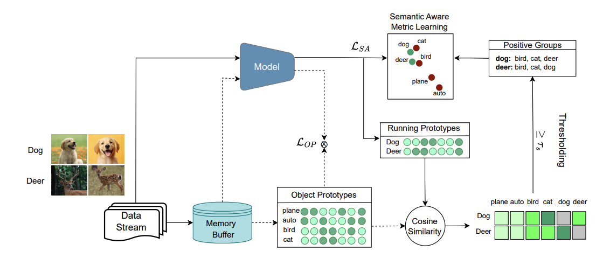

# Semantic Aware Representation Learning (SARL)
Official Repository for the  ICLR'25 paper [Semantic Aware Representation Learning for Lifelong Learning](https://openreview.net/forum?id=WwwJfkGq0G&noteId=JBzQCQBACo)

We extended the [SCoMMER](https://github.com/NeurAI-Lab/SCoMMER) repo with our method

## Overview


SARL employs activation sparsity to emulate brain-like sparse coding, representing each  object with a class prototype derived from the mean representations of object samples. The semantic relationships are utilized to encourage new object prototypes to align with the class prototypes of similar objects and diverge from dissimilar ones. Additionally, SARL ensures model stability through prototype regularization, mitigating forgetting and enabling effective consolidation of information in lifelong learning. 


## Setup
+ Use `python main.py` to run experiments.
+ To run SARL with the hyperparameters selected in the paper, use the files in the script folder

```
Seq-Cifar10:      python scripts/sarl/seq-cifar10.py
Seq-Cifar100:     python scripts/sarl/seq-cifar100.py
Seq-TinyImageNet: python scripts/sarl/seq-cifar100.py
GCIL-Cifar100:    python scripts/sarl/seq-cifar100.py
```    

## Cite our work
    @inproceedings{sarfrazsemantic,
      title={Semantic Aware Representation Learning for Lifelong Learning},
      author={Sarfraz, Fahad and Arani, Elahe and Zonooz, Bahram},
      booktitle={The Thirteenth International Conference on Learning Representations}
    }


## Requirements

- torch==1.7.0

- torchvision==0.9.0 

- quadprog==0.1.7
